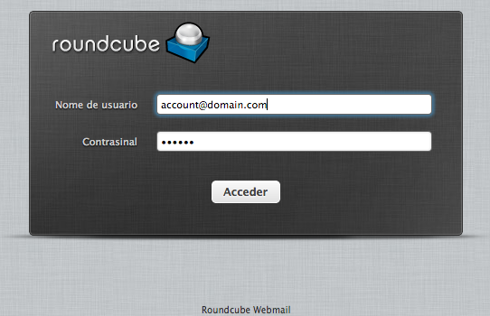
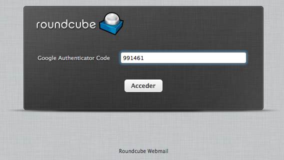
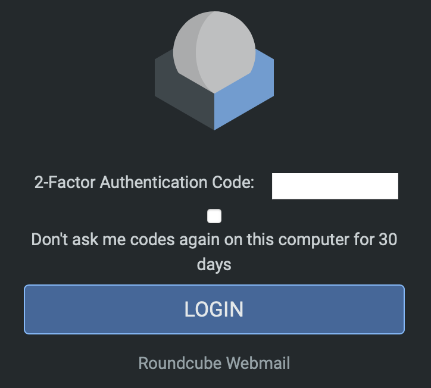
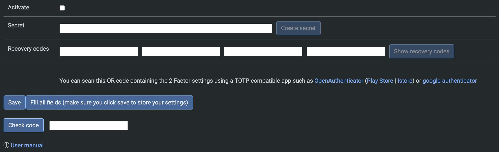
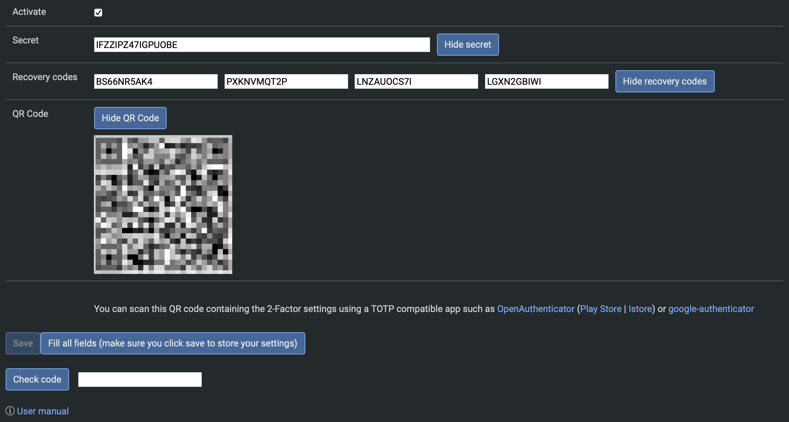
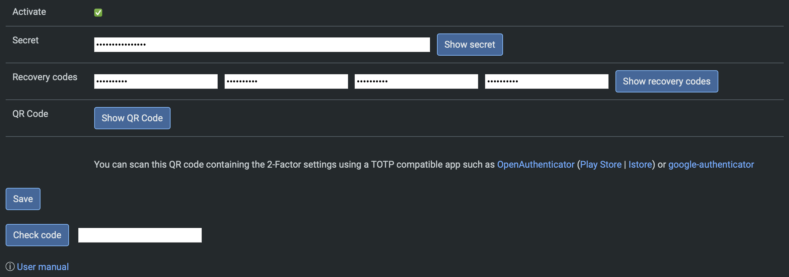

# Two-factor verification

This RoundCube plugin adds the 2-step verification (OTP) to the login process.

It works with all TOTP applications [RFC 6238](https://www.rfc-editor.org/info/rfc6238).

Some code by:

- [Ricardo Signes](https://github.com/rjbs)
- [Justin Buchanan](https://github.com/jusbuc2k)
- [Ricardo Iván Vieitez Parra](https://github.com/corrideat)
- [GoogleAuthenticator class](https://github.com/PHPGangsta/GoogleAuthenticator/) by Michael Kliewe (to _see_ secrets)
- [qrcode.js](https://github.com/davidshimjs/qrcodejs) by ShimSangmin
- Also thanks to [Victor R. Rodriguez Dominguez](https://github.com/vrdominguez) for some ideas and support
- Stephen K. Gielda
- [Manuel Delgado](https://github.com/valarauco/)
- kototilt@haiiro.dev

<br /><br />

## Screenshots


<br /><br />


<br /><br />

## Table of Contents
- [Installation](#installation)
  - [Get the plugin](#get-the-plugin)
  - [Activate the plugin](#activate-the-plugin)
  - [Configuration](#configuration)
    - [Variables](#variables)
- [Usage](#usage)
- [Docker Compose](#docker-compose)
- [Development](#development)
  - [Code formatting](#code-formatting)
- [Additional Information](#additional-information)
  - [Author](#author)
  - [Issues](#issues)
  - [TOTP Codes](#totp-codes)
  - [License](#license)
  - [Notes](#notes)
  - [Testing](#testing)
  - [Using with Kolab](#using-with-kolab)
  - [Client implementations](#client-implementations)
- [Uninstall](#uninstall)
- [For version 1.3.x](#for-version-13x)
- [Security incidents](#security-incidents)
  - [2022-04-02](#2022-04-02)

<br /><br />

## Installation

**If you are using Roundcube 1.3.x, please refer to section [For version 1.3.x](#for-version-13x)**.

### Get the plugin

**Method 1:** Clone from GitHub inside the plugins directory of Roundcube:

    1. `cd plugins`
    2. `git clone https://github.com/alexandregz/twofactor_gauthenticator.git`

**Method 2:** Use composer from the Roundcube root directory:

```sh
composer require alexandregz/twofactor_gauthenticator:dev-master
```

_NOTE:_ Answer **N** when the composer ask you about plugin activation.

### Activate the plugin

Activate the plugin by editing the `HOME_RC/config/config.inc.php` file:

```php
$config['plugins'] = [
        // Other plugins...
        'twofactor_gauthenticator',
];
```

_NOTE:_ For docker user, add env `ROUNDCUBE_PLUGINS=twofactor_gauthenticator` into docker-compose file. For detailed
information, see [Roundcube Docker Hub](https://hub.docker.com/r/roundcube/roundcubemail/).

### Configuration

Copy `HOME_RC/plugins/twofactor_gauthenticator/config.inc.php.dist` to
`HOME_RC/plugins/twofactor_gauthenticator/config.inc.php`.

#### Variables

Variables inside `config.inc.php`:

| Variable                          | Variable Type | Default Value | Description                                                                                                                                                                                                                                                                                                                                                                                                      |
|-----------------------------------|---------------|---------------|------------------------------------------------------------------------------------------------------------------------------------------------------------------------------------------------------------------------------------------------------------------------------------------------------------------------------------------------------------------------------------------------------------------|
| `force_enrollment_users`          | boolean       | false         | If true, all users must log in with 2-step verification. They will receive an alert message and cannot skip the configuration.                                                                                                                                                                                                                                                                                   |
| `whitelist`                       | array         | N/A           | A Whitelist of IPs which are allowed to bypass the 2FA, CIDR format available. <br /><br /> _NOTE:_ We need to use .0 IP to define LAN because the class CIDR have a issue about that (we can't use 129.168.1.2/24, for example). <br /><br /> _NOTE2:_ To create a empty whitelist, make sure it looks like this: <br />`$rcmail_config['whitelist'] = array();` <- There are NO QUOTES inside the parentheses. |
| `allow_save_device_30days`        | boolean       | false         | If true, there will be a checkbox in the the TOTP code prompting page. By ticking it, there will be no 2FA prompt for 30 days.                                                                                                                                                                                                                                                                                   | 
| `twofactor_formfield_as_password` | boolean       | false         | If true, the entered TOTP code will appear as password in the webpage when prompting it. Otherwise, it'll shown as text.                                                                                                                                                                                                                                                                                         |
| `users_allowed_2FA`               | array         | N/A           | Users allowed to use plugin (IMPORTANT: other users DON'T have plugin activated). Regex is supported. <br /><br /> _NOTE:_ plugin must be base32 valid characters ([A-Z][2-7]), see [PHPGansta Library](https://github.com/alexandregz/twofactor_gauthenticator/blob/master/PHPGangsta/GoogleAuthenticator.php#L18), from [Issues 139](https://github.com/alexandregz/twofactor_gauthenticator/issues/139).      |
| `enable_fail_logs`                | boolean       | false         | If true, 2FA failure will be logged in file twofactor_gauthenticator.log under HOME_RC/logs/. <br /><br /> Suggested by @pngd [issue 131](https://github.com/alexandregz/twofactor_gauthenticator/issues/131). <br /><br />Code by [@valarauco](https://github.com/valarauco) [#227](https://github.com/alexandregz/twofactor_gauthenticator/pull/227) |
| `twofactor_pref_encrypt`                | boolean       | false         | If true, twofactor user preferences (secret and codes) will be encrypted with Roundcube's DES key <br /><br />Code by [@valarauco](https://github.com/valarauco) [#225](https://github.com/alexandregz/twofactor_gauthenticator/pull/225) <br /><br />NOTE: when prefs are encrypted and you set this variable to `false`, you enter without twofactor authentication. Encryption it's not reversible.   |                                                                                                                                                                                                                                                                                                                                                                                     

The tickbox allows users to skip 2FA for 30 days:



Variables that only existed in **Samefield branch**:

| Variable                    | Variable Type | Default Value | Description                                                                                                                                                                                                                                                                    |
|-----------------------------|---------------|---------------|--------------------------------------------------------------------------------------------------------------------------------------------------------------------------------------------------------------------------------------------------------------------------------|
| `2step_codes_on_login_form` | boolean       | false         | If config value _2step_codes_on_login_form_ is true, 2-step codes (and recovery) must be sended with password value, append to this, from the login screen: "Normal" codes just following password (passswordCODE), recovery codes after two pipes (passsword\|\|RECOVERYCODE) |

<br /><br />

## Usage

Go to Roundcube Settings > 2-Factor Authentication:



The most easy way to configure it is by clicking "Fill all fields". The plugin automatically creates the secret as
well as the recovery codes for you:



You can store/create TOTP codes with any authenticator app by either scanning the QR code or entering the secret
manually.

Manually entering the secret as well as recovery codes is also possible.
Note that the recovery codes are optional, so you can leave them blank.

After setting up the authenticator, enter the code and press "Check code". If the code is correct, you can press "Save"
to save the configuration and enable 2-step verification.



<br /><br />

## Docker Compose

You can use `docker-compose` file to modify and test plugin:

- Replace `mail.EXAMPLE.com` for your IMAP and SMTP server.
- `docker-compose up`
- You can use `adminer` to check DB and reset secrets, for example.

<br /><br />

## Development

### Code formatting

Install PHP-CS-Fixer (requires `composer` to be installed):

```sh
composer install --working-dir=./tools/php-cs-fixer
```

Run the coding standards fixer (in current working directory):

```sh
./tools/php-cs-fixer/vendor/bin/php-cs-fixer fix .
```

<br /><br />

## Additional Information

### Author

Alexandre Espinosa Menor <aemenor@gmail.com>

### Issues

Just open issues using GitHub issues instead of sending me emails, please.
Gmail usually marks messages like this as SPAMs.

### TOTP Codes

TOTP codes have a 2\*30 seconds clock tolerance. (May be editable in future versions)

### License

MIT, see License

### Notes

Tested with RoundCube 0.9.5 and Google app. Also with Roundcube 1.0.4 and 1.6.9 with OpenAuthenticator, Authy, etc.

Remember, time synchronization it's essential to TOTP: "For this to work, the clocks of the user's device and the server
need to
be roughly synchronized (the server will typically accept one-time passwords generated from timestamps that differ by ±1
from the client's timestamp)" (
from [Wikipedia: Time-based one-time password](https://en.wikipedia.org/wiki/Time-based_One-time_Password_Algorithm)).

### Testing

- Vagrant: https://github.com/alexandregz/vagrant-twofactor_gauthenticator
- Docker: https://hub.docker.com/r/alexandregz/twofactor_gauthenticator/

### Using with Kolab

Add a symlink into the public_html/assets directory

[Show explained](https://github.com/alexandregz/twofactor_gauthenticator/issues/29#issuecomment-156838186)
by [Martin Stone](https://github.com/d7415)

### Client implementations

You can use various [OTP clients](https://en.wikipedia.org/wiki/HMAC-based_One-time_Password_Algorithm#Applications)
, by [helmo](https://github.com/helmo).

<br /><br />

## Uninstall

To deactivate the plugin, there are two methods:

- For one only: Restore the user prefs from DB to null (rouncubeDB.users.preferences) which the user plugin options
  stored.

- To all: Remove the plugin from config.inc.php thus remove the plugin itself.

<br /><br />

## For version 1.3.x

Use _1.3.9-version_ branch

`$ git checkout 1.3.9-version`

If you are using other versions other than 1.3.9, use _master_ version normally (thanks
to [tborgans](https://github.com/tborgans))


<br /><br />


<br /><br />

## Security incidents

### 2022-04-02

Reported by kototilt@haiiro.dev (thx for the report and the PoC script)

I made a little modification to the script to disallow user to save config without param session generated from a
rendered page to force user to introduce previously 2FA code and navigate across site.

_NOTE:_ I also checked if the user has 2FA activated because with only first condition -check SESSION- app kick me out
before activating 2FA.

<br />

**Function `twofactor_gauthenticator_save()`**

On function `twofactor_gauthenticator_save()` I added this code:

```php
// save config
function twofactor_gauthenticator_save()
{
    $rcmail = rcmail::get_instance();

    // 2022-04-03: Corrected security incidente reported by kototilt@haiiro.dev
    //					"2FA in twofactor_gauthenticator can be bypassed allowing an attacker to disable 2FA or change the TOTP secret."
    //
    // Solution: if user don't have session created by any rendered page, we kick out
    $config_2FA = self::__get2FAconfig();
    if(!$_SESSION['twofactor_gauthenticator_2FA_login'] && $config_2FA['activate']) {
        $this->__exitSession();
    }
```

The idea is to create a session variable from a rendered page, redirected from `__goingRoundcubeTask` function (
redirector to `roundcube tasks`)

<br />

**Tests with PoC Python Script**

Previously, with security compromised:

```bash
alex@vosjod:~/Desktop/report$ ./poc.py
Password:xxxxxxxx
1. Fetching login page (http://localhost:8888/roundcubemail-1.4.8)
2. Logging in
  POST http://localhost:8888/roundcubemail-1.4.8/?_task=login
3. Disabling 2FA
  POST http://localhost:8888/roundcubemail-1.4.8/?_task=settings&_action=plugin.twofactor_gauthenticator-save
  POST returned task "settings"
2FA disabled!
```

Modified code and tested again, not allowed to deactivated/modified without going to a RC task (with 2FA
authentication):

```bash
alex@vosjod:~/Desktop/report$ ./poc.py
Password:xxxxxxxxx
1. Fetching login page (http://localhost:8888/roundcubemail-1.4.8)
2. Logging in
  POST http://localhost:8888/roundcubemail-1.4.8/?_task=login
3. Disabling 2FA
  POST http://localhost:8888/roundcubemail-1.4.8/?_task=settings&_action=plugin.twofactor_gauthenticator-save
  POST returned task "login"
Expected "settings" task, something went wrong
```
